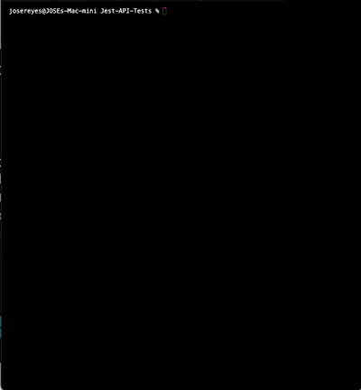

# Jest-API-Tests

## Description: 
Jest-API-Tests is a testing framework designed to validate API endpoints against a local 
[mock-server](https://github.com/JReyes11/mock-server) powered by json-server. This project provides a lightweight and efficient way to perform API testing using Jest, ensuring consistent responses without relying on a live backend. Ideal for test automation, it enables fast, isolated, and repeatable API validation.

## 🚀 Setup Instructions

## Prerequisites
### Setup the Mock server
- Clone the [mock-server](https://github.com/JReyes11/mock-server) and follow the instructions in the Readme file to ensure the server is up and running.

### For this repository

- Ensure you have Yarn, Node.js and Git installed. 
- Clone the repository.
- Install dependencies via `yarn`

### Running Tests
From the terminal, you can run the entire suite of tests or individual spec files.

To run the entire suite of tests
`yarn test`

To run an individual spec file, such as the orders test: 
`yarn test __tests__/orders`

